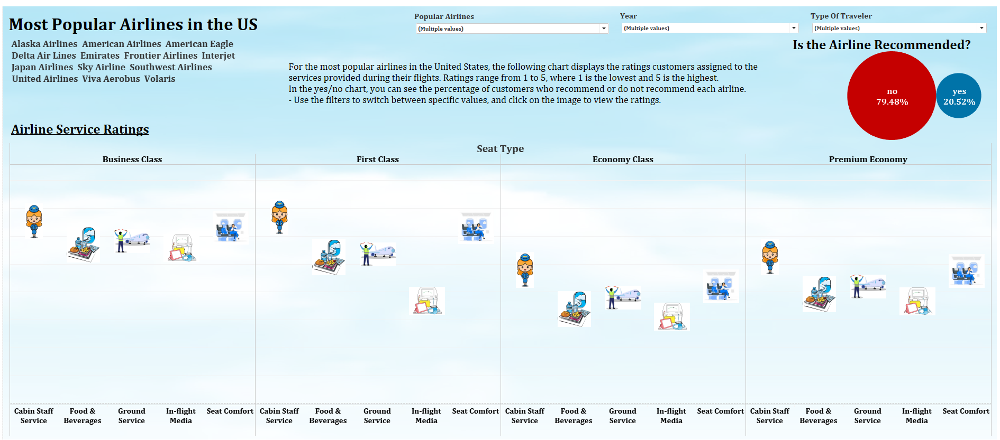
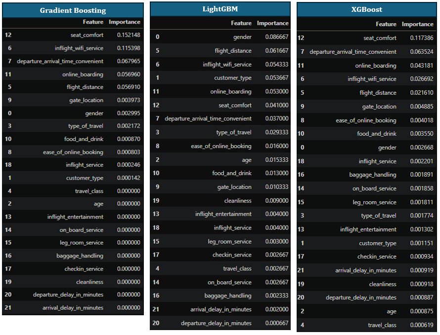

# ds_project_4
Project 4 Machine Learning
===
Objective
---
The objective of this project is to analyze and visualize customer satisfaction with airlines by deploying a web app that integrates Tableau visualizations for interactive data exploration. By examining various ratings assigned by users to airline services, we can observe the relationships between ratings, seat types, and changes over time. This analysis aims to identify which airlines provide the best services and how likely customers are to recommend them.

Additionally, the web app implements machine learning models to predict whether a flight will be satisfactory based on user inputs. It includes the code necessary to run these predictions, providing users with insights into potential flight satisfaction.

Visualization Overview
---
**Description of Graphs**

The graphs include interactive filters that allow users to explore different aspects of the dataset on customer satisfaction with airlines. The most notable visualizations show a general trend of declining satisfaction ratings from 2012 to 2023, suggesting an increase in traveler expectations. Additionally, in-flight media services (internet, TV) are consistently rated as poor.

**Several dashboards have been created to provide a comprehensive view:**

- *Demographic Satisfaction Dashboard:* This additional panel provides information on customer satisfaction based on demographic variables such as gender, age, and travel distance. It allows for an analysis of how these characteristics influence satisfaction ratings, offering a more detailed view of the customer experience based on their profile.

- *General Airline Satisfaction Dashboard:* This panel allows users to observe how ratings for different airlines vary and how these are perceived in relation to their costs. Leisure and business travelers tend to have higher expectations, which is reflected in their ratings. Users can select specific airlines to analyze their trends over time.

- *Most Popular Airlines in the U.S. Dashboard:* This panel highlights 13 well-known airlines and assesses the likelihood of customer recommendations. It includes descriptions of how ratings are calculated and offers interactive images of the services, as well as graphs that display the recommendation status of each airline.

Together, these dashboards enable users to gain a deep understanding of customer satisfaction in the airline industry, facilitating the identification of trends and areas for improvement.

Modeling Approach
---
For one of the modeling notebooks:

- *Preprocessing:*

    - Ratings features were cast to strings for one-hot encoding, and the ID column was dropped.
    - Numeric Features: Age, flight distance, departure delay (minutes), arrival delay (minutes).
    - Binary Features: Gender, customer type, type of travel.
    - Categorical Features: Ratings features and travel class.

- *Model Comparison:*

    - Five separate pipelines were tested to evaluate the impact of encoding methods on model performance.
    - Models compared included Logistic Regression, ADA Boost Classifier, Gradient Boosting Classifier, XGBoost Classifier, and LightGBM.
    - The best-performing models were Gradient Boosting, XGBoost, and LightGBM, with LightGBM emerging as the top choice due to its balanced feature importance.

- *Grid Search and Cross Validation:*

    - Grid searches were conducted to optimize hyperparameters for LightGBM and XGBoost.
    - Results for LightGBM with one-hot encoded features yielded a mean accuracy of 96.46%, mean F1 score of 95.84%, mean precision of 97.57%, mean recall of 94.17%, and mean ROC AUC of 99.53%.

Web Application
---
In addition to the visualizations, we developed a web application using Flask. This application incorporates:

- Frameworks and Technologies: Flask, JavaScript, HTML, CSS.
- Features:
    - Integration of Tableau visualizations for interactive data exploration.
    - Implementation of machine learning models to predict whether a flight will be satisfactory based on user inputs.
    - The web app includes the code necessary to run predictions, providing users with insights into potential flight satisfaction.

Limitations
--
**1. Imbalanced Feature Importance:** There is a significant imbalance in customer loyalty, with five times as many loyal customers as disloyal ones. Additionally, there are more than twice as many business travelers compared to personal travelers.

**2. Customer Bias:** Business travelers tend to be more easily satisfied, especially when their travel costs are covered by their company. They are also more likely to complete surveys after their flights, introducing potential bias. Conversely, personal travelers may experience higher stress levels when paying out of pocket, especially when traveling with companions, including minors.

**3. Model Performance:** While the LightGBM (LGBM) model provided slightly better metrics and a more balanced distribution of feature importances, it was not used for the final model due to deployment limitations on PythonAnywhere.

**4. Age Limitations:** The minimum age for respondents was set at 7, which raises concerns about the reliability of many responses. Younger respondents may also be more likely to express dissatisfaction, as they tend to fill out surveys.

**5. Lack of Data on Airports:** The dataset does not include information about the airports involved, meaning that factors like boarding processes and ticket purchasing experiences can vary significantly between airlines. Additionally, the maximum number of customers per airline in the dataset was limited to 100, and there is no clarity on how customers were selected.

**6. Data Source Uncertainty:** The dataset lacks a clear source, complicating the reliability of the findings. While a second dataset spans from 2012 to 2023, it also does not specify its source.

Conclusion
---
The visualizations created in Tableau, along with the Flask web application, effectively illustrate the evolving landscape of customer satisfaction in the airline industry. By analyzing ratings from 2012 to 2023, we observe a clear trend of declining satisfaction, likely influenced by rising traveler expectations. The interactive dashboards allow users to explore specific airlines and their services, offering valuable insights into customer perceptions.

These visualizations and tools not only tell a compelling story about airline customer satisfaction but also serve as a useful resource for consumers and industry stakeholders aiming to improve service quality and meet evolving customer demands.
